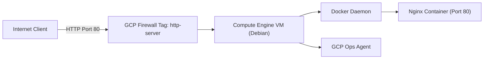

# Automated & Containerized GCP Web Architecture

A containerized Nginx web application hosted on an isolated Google Cloud Platform (GCP) Compute Engine virtual machine. This repository contains the complete automation scripts, container configuration, and step-by-step instructions to deploy a highly available and observable cloud environment.

## 🏗️ Architecture Overview

The following diagram illustrates the deployment topology, displaying how public web traffic is routed securely through GCP firewall rules into the Docker container running inside the VM.

## 🛠️ Key Core Competencies Demonstrated

* Infrastructure Administration: Configured and secured a cloud-hosted Debian Linux virtual machine within GCP Free-Tier limits.
* Containerization: Built a custom, lightweight container image utilizing an Alpine-based Nginx parent image to minimize attack surface area.
* Infrastructure Automation: Developed an idempotent shell bootstrap script (startup.sh) that fully automates system updates, engine installations, and container initialization.
* Cloud Observability: Integrated the native Google Cloud Ops Agent to establish host-level logging and system telemetry streaming.

## 📂 Repository Structure

    index.html - The modern, responsive portfolio landing page served to public clients.

    Dockerfile - Instruction manifest for packaging the custom web server.

    startup.sh - Automated shell script responsible for zero-touch VM provisioning.

    README.md - Technical project documentation and system architecture details.

## 🚀 Step-by-Step Deployment Guide

Follow these instructions to spin up the identical environment manually or via automation.
Prerequisites

    A Google Cloud Platform active account (Free-Tier or paid).

    GCP Compute Engine API enabled.

1. Host Virtual Machine Configuration

Deploy a Compute Engine instance utilizing these specific parameters to remain within the GCP Always Free Tier:

    Name: sysadmin-portfolio-host

    Region: us-central1 (Iowa), us-east1 (South Carolina), or us-west1 (Oregon)

    Machine Type: e2-micro (1 Shared vCPU, 1 GB RAM)

    Boot Disk: Debian GNU/Linux 12, 30 GB standard persistent disk (pd-standard)

    Firewall: Enable Allow HTTP Traffic (This automatically attaches the http-server network tag)

2. Manual Host Configuration & Containerization

Once your VM is running, click the SSH button next to your instance in the GCP Console to access your secure shell, and execute the following commands:
Update & Patch System Packages
Bash

sudo apt-get update && sudo apt-get upgrade -y

Install Docker Engine
Bash

curl -fsSL [https://get.docker.com](https://get.docker.com) -o get-docker.sh
sudo sh get-docker.sh
sudo usermod -aG docker $USER

(Note: Exit the SSH window and reconnect for group permission updates to take effect)
Create Your Application Image

Create a Dockerfile and index.html in your directory, then compile your custom Nginx image:
Bash

docker build -t munro-portfolio:v1 .

Deploy the Container
Bash

docker run -d -p 80:80 --name portfolio-web munro-portfolio:v1

3. Setup Telemetry Monitoring

To stream system RAM, CPU, and network telemetry directly to your GCP Cloud Monitoring dashboard, run the official Google Cloud Ops Agent installation:
Bash

curl -sSO [https://dl.google.com/cloudagents/add-google-cloud-ops-agent-repo.sh](https://dl.google.com/cloudagents/add-google-cloud-ops-agent-repo.sh)
sudo bash add-google-cloud-ops-agent-repo.sh --also-install

📈 System Metrics & Monitoring

By deploying the Google Cloud Ops Agent, this infrastructure feeds real-time telemetry into Cloud Monitoring.

To view system health metrics:

    Navigate to the Monitoring section of the Google Cloud Console.

    Select Dashboards -> VM Instances.

    View real-time charts detailing CPU Utilization, Memory Usage, Disk I/O, and Network Traffic.
